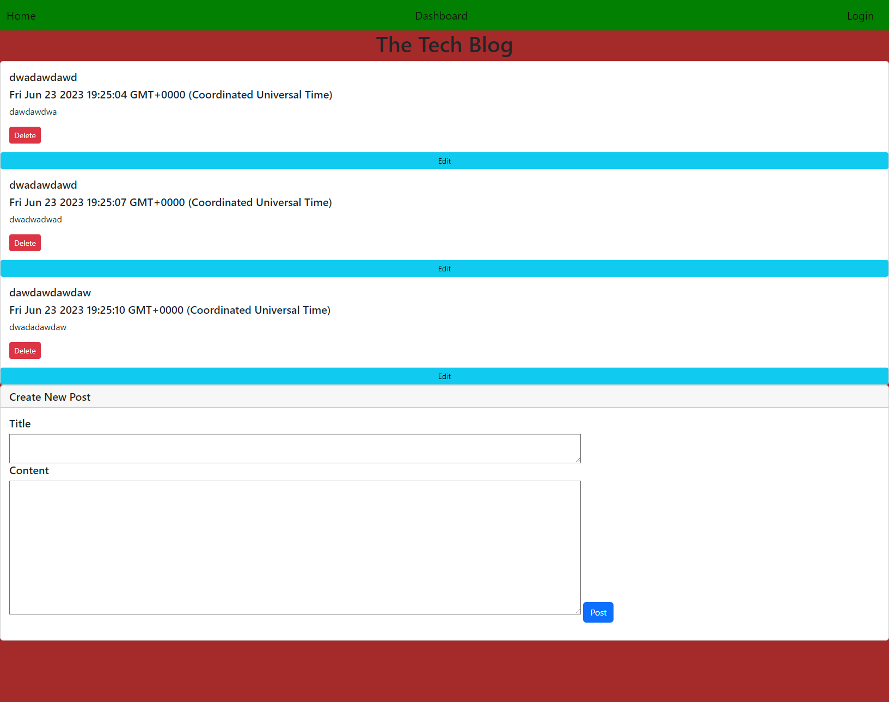
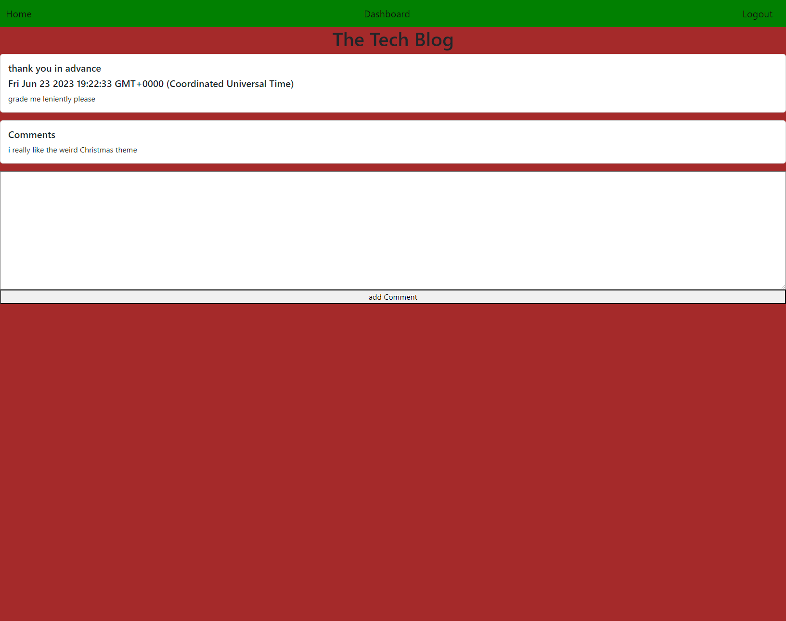
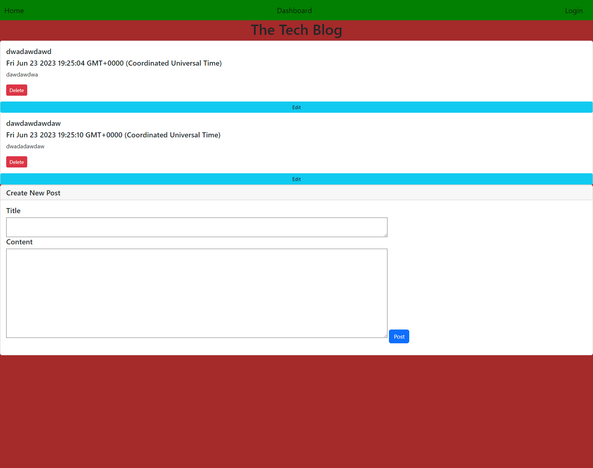
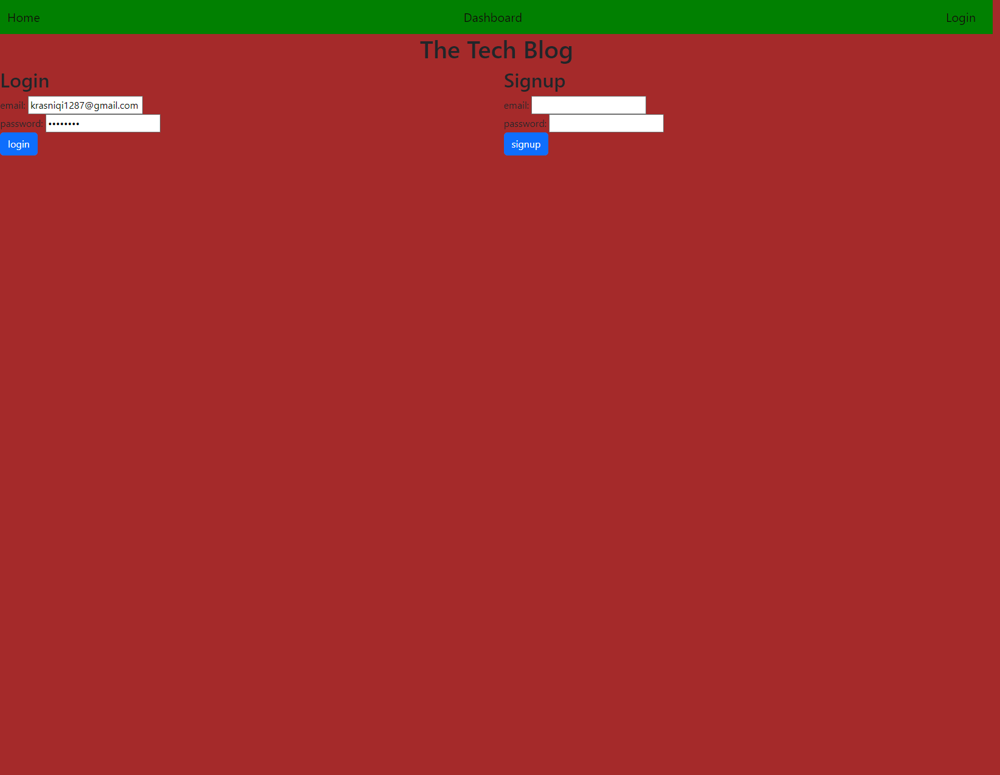
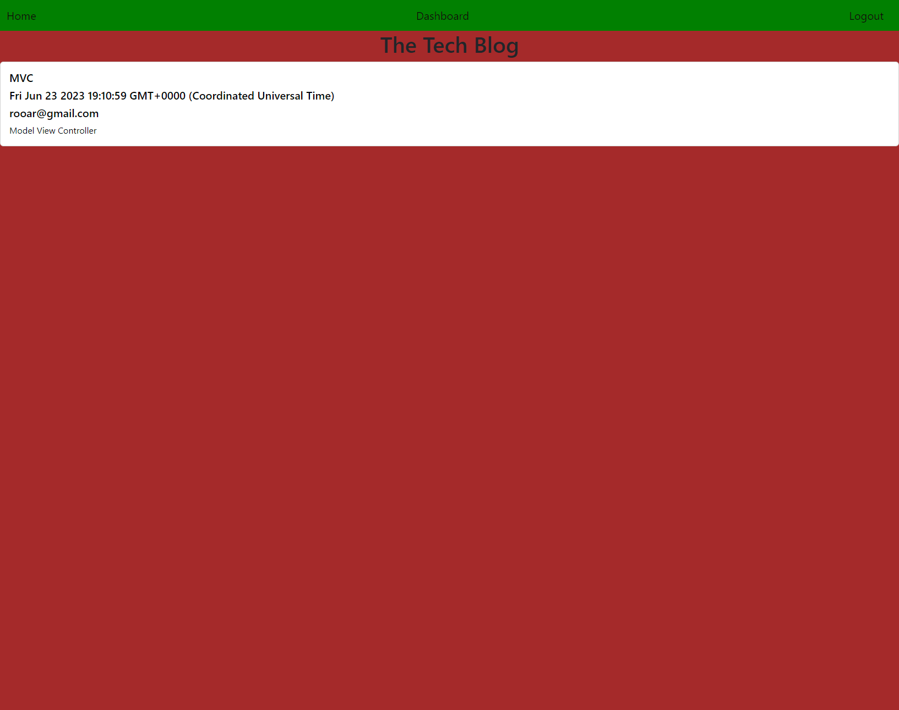
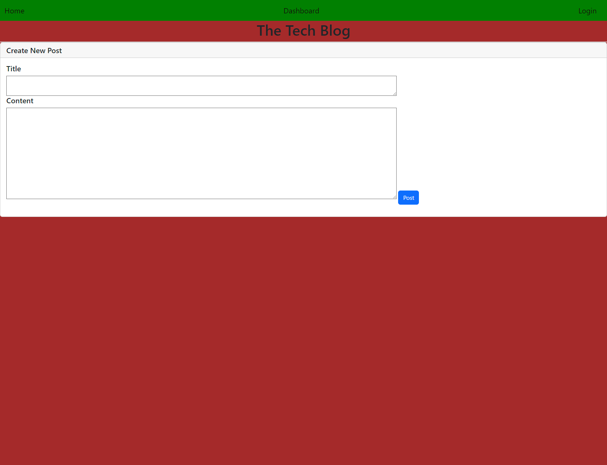
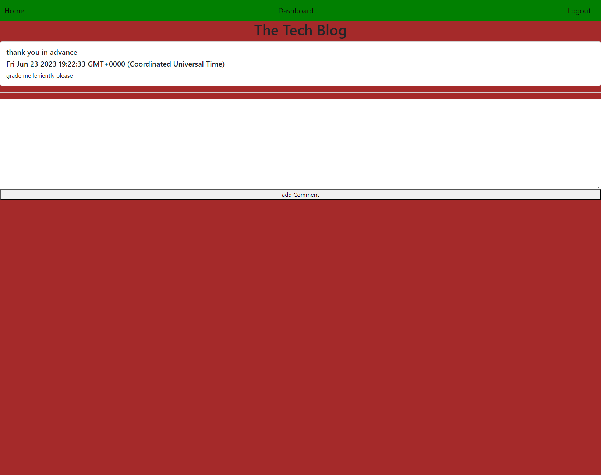

# Blog

## Badges

## Description

- Motivation: My motivation for this program was to creat a website where people can post things about tech and others can comment on thos posts
- Goal: to test my abilites with hbs and sequlize to its full extent
- Problems Solved: its solves the problem of having infomation be shared between others in an easy accesible way
- What I Learned: I learned my knowleadge about this unit was absolutly awful at first and finally understood it towards then end

## Installation

bcrypt: "^5.0.0",
connect-session-sequelize: "^7.0.4",
dotenv: "^8.2.0",
express: "^4.17.1",
express-handlebars: "^5.2.0",
express-session: "^1.17.1",
mysql2: "^2.2.5",
sequelize: "^6.3.5"
nodemon: "^2.0.22"

## Usage

## License

This program is done under the license: [MIT License](https://choosealicense.com/licenses/mit/)

## How To Contribute

## Questions

GitHub: https://github.com/Albikras

If you want to reach me with additional question click my email link here: Krasniqi1298@gmail.com

## Links

Heroku: https://blogtech1287-5a4305b591eb.herokuapp.com

## Screenshot

